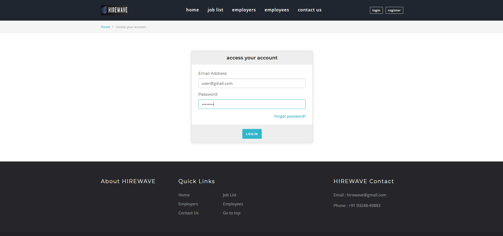

#  HIREWAVE – Job Recruitment Website

_A dynamic job portal connecting job seekers with employers, built using **PHP** and **MySQL**._

---

##  Features

- User registration and authentication (job seeker & employer)
- Job application and posting system
- Certificate and resume upload/download
- Profile dashboards and admin tools
- Database-driven job listings
- Secure login with session management
- Contact form for inquiries

---

##  Tech Stack

| Technology  | Description              |
|-------------|--------------------------|
| PHP         | Server-side scripting    |
| MySQL       | Database storage         |
| HTML/CSS    | Frontend layout & design |
| Bootstrap   | Responsive UI            |
| JavaScript  | Client-side interactivity|

---

##  Folder Structure
HIREWAVE/
├── Database/
│ └── hw_database.sql
├── System/
│ ├── *.php (UI & Logic)
│ ├── app/
│ ├── constants/
│ ├── bootstrap/, css/
└── php/
└── phpinfo.php

---

##  How to Run the Project

1. Install [XAMPP](https://www.apachefriends.org/) or WAMP.
2. Move the `HIREWAVE/` folder to your `htdocs/` directory.
3. Start Apache and MySQL from the XAMPP control panel.
4. Open phpMyAdmin and import the `hw_database.sql` file into a new database named `hirewave`.
5. Visit: `http://localhost/HIREWAVE/System/`

---

##  Screenshots

---

> 💬 *Connecting Careers with Code – HIREWAVE.*

